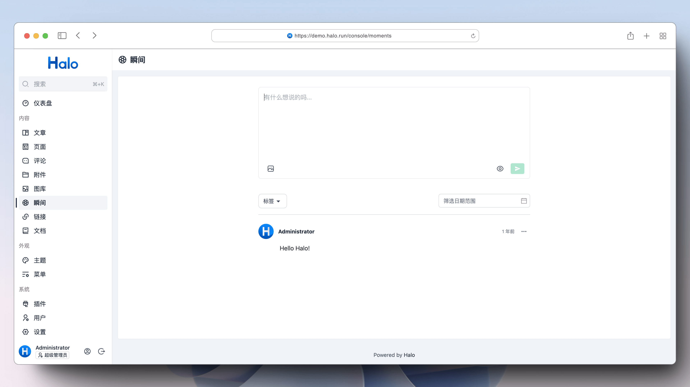

# plugin-moments

Halo 2.0 的瞬间管理插件，提供一个轻量级的内容发布功能，支持发布图文、视频、音频等内容。

## 功能特性

- 支持发布图文、视频、音频等多媒体内容
- 提供标签管理功能，支持按标签筛选瞬间
- 主题端 `/moments` 列表路由和 `/moments/{name}` 详情路由
- 提供匿名可访问的公共 REST API，方便前端框架构建客户端渲染瞬间列表
- RSS 订阅支持，路由为 `/moments/rss.xml`
- 支持将瞬间数据同步至 Halo 搜索系统
- 支持通过 MCP Server 查询、获取、发布和删除瞬间

## 安装使用

1. 下载，目前提供以下两个下载方式：
    - Halo 应用市场：<https://halo.run/store/apps/app-SnwWD>
    - GitHub Releases：访问 [Releases](https://github.com/halo-sigs/plugin-moments/releases) 下载 Assets 中的 JAR 文件。
2. 安装，插件安装和更新方式可参考：<https://docs.halo.run/user-guide/plugins>
3. 安装完成之后，访问 Console 左侧的**瞬间**菜单项，即可进行管理。
4. 前台访问地址为 `/moments`，需要注意的是，此插件需要主题提供模板（`moments.html`）才能访问 `/moments`。
5. 此插件也提供了 RSS 订阅的路由，可以访问 `/moments/rss.xml`。
6. 此插件将数据同步至 Halo 搜索，type 为 `moment.moment.halo.run`。

## MCP Server 集成

安装并启用 [Halo MCP Server](https://github.com/halo-dev/plugin-mcp-server) 1.x 后，本插件会自动提供以下 MCP 工具：

| 工具 | 说明 |
| --- | --- |
| `PluginMoments__list_moments` | 分页查询瞬间，支持按作者、标签、可见性、审核状态和发布时间筛选 |
| `PluginMoments__get_moment` | 按资源名称获取瞬间详情、作者和统计信息 |
| `PluginMoments__create_moment` | 以当前 MCP 访问密钥所有者的身份发布图文瞬间 |
| `PluginMoments__delete_moment` | 按资源名称永久删除瞬间，调用前必须获得用户明确确认 |

需要在 MCP Server 的访问密钥设置中选择需要开放的工具。未安装 MCP Server 时，不影响瞬间插件的其他功能。

## 主题适配

此插件为主题端提供了：

- **列表路由** `/moments`（模板 `moments.html`）和**详情路由** `/moments/{name}`（模板 `moment.html`）
- **Finder API**（`momentFinder`）：可在主题任意位置渲染瞬间列表，无需依赖路由页面
- **公共 REST API**：供前端框架构建客户端渲染瞬间列表使用

详细的主题适配文档请参考：

- [主题 API 文档](./dev/theme-api.md) — 模板路由、模板变量、Finder API、类型定义
- [REST API 文档](./dev/rest-api.md) — 公共 API 端点说明

## 开发文档

- [开发环境搭建](./dev/development.md) — 本地开发、构建、测试
