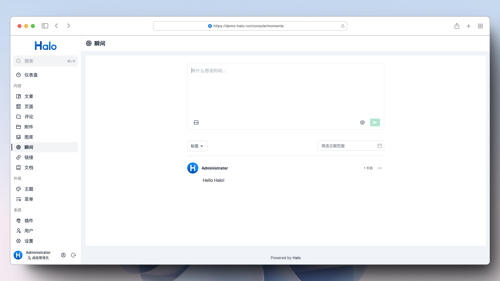

# plugin-moments

Halo 2.0 的瞬间管理插件，提供一个轻量级的内容发布功能，支持发布图文、视频、音频等内容。



## 使用方式

1. 下载，目前提供以下两个下载方式：
    - Halo 应用市场：<https://halo.run/store/apps/app-SnwWD>
    - GitHub Releases：访问 [Releases](https://github.com/halo-sigs/plugin-moments/releases) 下载 Assets 中的 JAR 文件。
2. 安装，插件安装和更新方式可参考：<https://docs.halo.run/user-guide/plugins>
3. 安装完成之后，访问 Console 左侧的**瞬间**菜单项，即可进行管理。
4. 前台访问地址为 `/moments`，需要注意的是，此插件需要主题提供模板（moments.html）才能访问 `/moments`。
5. 此插件也提供了 RSS 订阅的路由，可以访问 `/moments/rss.xml`。

## 开发环境

插件开发的详细文档请查阅：<https://docs.halo.run/developer-guide/plugin/introduction>

所需环境：

1. Java 17
2. Node 18
3. pnpm 8
4. Docker (可选)

克隆项目：

```bash
git clone git@github.com:halo-sigs/plugin-moments.git

# 或者当你 fork 之后

git clone git@github.com:{your_github_id}/plugin-moments.git
```

```bash
cd path/to/plugin-moments
```

### 运行方式 1（推荐）

> 此方式需要本地安装 Docker

```bash
# macOS / Linux
./gradlew pnpmInstall

# Windows
./gradlew.bat pnpmInstall
```

```bash
# macOS / Linux
./gradlew haloServer

# Windows
./gradlew.bat haloServer
```

执行此命令后，会自动创建一个 Halo 的 Docker 容器并加载当前的插件，更多文档可查阅：<https://docs.halo.run/developer-guide/plugin/basics/devtools>

### 运行方式 2

> 此方式需要使用源码运行 Halo

编译插件：

```bash
# macOS / Linux
./gradlew build

# Windows
./gradlew.bat build
```

修改 Halo 配置文件：

```yaml
halo:
    plugin:
        runtime-mode: development
        fixedPluginPath:
            - "/path/to/plugin-moments"
```

最后重启 Halo 项目即可。

## 主题适配

目前此插件为主题端提供了 `/moments` 路由，模板为 `moments.html`，也提供了 [Finder API](https://docs.halo.run/developer-guide/theme/finder-apis)，可以将瞬间列表渲染到任何地方。

### 模板变量

#### 列表页面 /moments

- 模板路径：/templates/moments.html
- 访问路径：/moments?tag={tag} | moments/page/{page}?tag={tag}

**参数**：

- tag：标签名称，用于筛选。

**变量**：

- moments：[#UrlContextListResult\<MomentVo>](#urlcontextlistresult-momentvo)
- tags：[#List\<MomentTagVo>](#momenttagvo)

**示例**：

```html
<!-- 渲染标签列表 -->
<ul>
    <li th:each="tag : ${tags}">
        <a
            th:href="|/moments?tag=${tag.name}|"
            th:classappend="${#lists.contains(param.tag, tag.name) ? 'active' : ''}"
        >
            <span th:text="${tag.name}"></span>
            <span th:text="${tag.momentCount}"></span>
        </a>
    </li>
</ul>

<div>
    <!-- 渲染瞬间列表 -->
    <ul>
        <li th:each="moment : ${moments.items}" th:with="content=${moment.spec.content}">
            <div th:if="${not #strings.isEmpty(content.html)}" th:utext="${content.html}"></div>
            <th:block th:if="${not #lists.isEmpty(content.medium)}" th:each="momentItem : ${content.medium}">
                
                <video th:if="${momentItem.type.name == 'VIDEO'}" th:src="${momentItem.url}"></video>
                <audio th:if="${momentItem.type.name == 'AUDIO'}" th:src="${momentItem.url}" controls="true"></audio>
            </th:block>
        </li>
    </ul>
    <div th:if="${moments.hasPrevious() || moments.hasNext()}">
        <a th:href="@{${moments.prevUrl}}">
            <span>上一页</span>
        </a>
        <span th:text="${moments.page}"></span>
        <a th:href="@{${moments.nextUrl}}">
            <span>下一页</span>
        </a>
    </div>
</div>
```

#### 详情页面 /moments/{name}

- 模板路径：/templates/moment.html
- 访问路径：/moments/{name}

**变量**：

- moment：[#MomentVo](#momentvo)

**示例**：

```html
<div>
    <div th:with="content=${moment.spec.content}">
        <div th:if="${not #strings.isEmpty(content.html)}" th:utext="${content.html}"></div>
        <th:block th:if="${not #lists.isEmpty(content.medium)}" th:each="momentItem : ${content.medium}">
            
            <video th:if="${momentItem.type.name == 'VIDEO'}" th:src="${momentItem.url}"></video>
            <audio th:if="${momentItem.type.name == 'AUDIO'}" th:src="${momentItem.url}" controls="true"></audio>
        </th:block>
    </div>
</div>
```

### Finder API

#### listAll()

获取全部瞬间内容。

**返回值类型**：List<[#MomentVo](#momentvo)>

**示例**：

```html
<ul>
    <li th:each="moment : ${momentFinder.listAll()}" th:with="content = ${moment.spec.content}">
        <div th:if="${not #strings.isEmpty(content.html)}" th:utext="${content.html}"></div>
        <th:block th:if="${not #lists.isEmpty(content.medium)}" th:each="momentItem : ${content.medium}">
            
            <video th:if="${momentItem.type.name == 'VIDEO'}" th:src="${momentItem.url}"></video>
            <audio th:if="${momentItem.type.name == 'AUDIO'}" th:src="${momentItem.url}" controls="true"></audio>
        </th:block>
    </li>
</ul>
```

#### list(page, size)

根据分页参数获取瞬间列表。

**参数**：

1. `page: int` - 分页页码，从 1 开始
2. `size: int` - 分页条数

**返回值类型**：[ListResult\<MomentVo>](#listresult-momentvo)

**示例**：

```html
<th:block th:with="moments = ${momentFinder.list(1, 10)}">
    <ul>
        <li th:each="moment : ${moments.items}" th:with="content = ${moment.spec.content}">
            <div th:if="${not #strings.isEmpty(content.html)}" th:utext="${content.html}"></div>
            <th:block th:if="${not #lists.isEmpty(content.medium)}" th:each="momentItem : ${content.medium}">
                
                <video th:if="${momentItem.type.name == 'VIDEO'}" th:src="${momentItem.url}"></video>
                <audio th:if="${momentItem.type.name == 'AUDIO'}" th:src="${momentItem.url}" controls="true"></audio>
            </th:block>
        </li>
    </ul>
    <div>
        <span th:text="${moments.page}"></span>
    </div>
</th:block>
```

### 类型定义

#### MomentVo

```json
{
    "metadata": {
        "name": "string", // 唯一标识
        "labels": {
            "additionalProp1": "string"
        },
        "annotations": {
            "additionalProp1": "string"
        },
        "creationTimestamp": "2022-11-20T13:06:38.512Z" // 创建时间
    },
    "spec": {
        "content": {
            "raw": "string", // 原始内容，一般用于编辑器使用
            "html": "string", // HTML 内容，用于主题端进行最终渲染的内容
            "medium": [
                // 媒体内容
                {
                    "type": "#MomentMediaType", // 类型
                    "url": "string", // 链接
                    "originType": "string" // 原始类型，例如：image/jpeg
                }
            ]
        },
        "releaseTime": "string", // 发布时间
        "visible": "PUBLIC", // 可见性
        "owner": "string", // 所属用户
        "tags": ["string"] // 所拥有的标签
    },
    "owner": {
        "name": "string", // 用户名
        "avatar": "string", // 头像
        "bio": "string", // 描述
        "displayName": "string" // 显示名称
    },
    "stats": {
        "upvote": 0, // 点赞数
        "totalComment": 0, // 评论数
        "approvedComment": 0 // 审核通过的评论数
    }
}
```

#### MomentMediaType

```java
enum Target {
  PHOTO,                                     // 图片
  VIDEO,                                     // 视频
  POST,                                      // 文章
  AUDIO;                                     // 音频
}
```

#### ListResult<MomentVo>

```json
{
    "page": 0, // 当前页码
    "size": 0, // 每页条数
    "total": 0, // 总条数
    "items": "List<#MomentVo>", // 瞬间列表数据
    "first": true, // 是否为第一页
    "last": true, // 是否为最后一页
    "hasNext": true, // 是否有下一页
    "hasPrevious": true, // 是否有上一页
    "totalPages": 0 // 总页数
}
```

#### UrlContextListResult<MomentVo>

```json
{
    "page": 0, // 当前页码
    "size": 0, // 每页条数
    "total": 0, // 总条数
    "items": "List<#MomentVo>", // 瞬间列表数据
    "first": true, // 是否为第一页
    "last": true, // 是否为最后一页
    "hasNext": true, // 是否有下一页
    "hasPrevious": true, // 是否有上一页
    "totalPages": 0, // 总页数
    "prevUrl": "string", // 上一页链接
    "nextUrl": "string" // 下一页链接
}
```

#### MomentTagVo

```json
{
    "name": "string", // 标签名称
    "momentCount": 0 // 标签所属的 moment 数量
}
```
